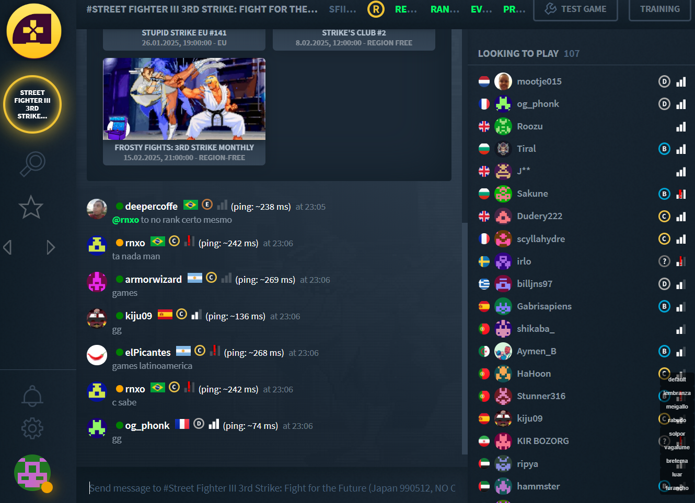

# Fightcade Renhanced Plugins
* Author: Ren
* Created: 2024-12-06
* Website: https://arkadyzja.honmaru.pl



## Motivation
This is a sample reference collection of plugins for those who wish to write their own Fightcade frontend plugins.

## Plugins:
- Favorite "star" button on the left side pannel - for fast access
- Theme selector - for those who wish to write and test their own themes, you can also set the default on startup
- Favorite navigation buttons - those buttons switch you to next or previous favorite channel quickly 
to see if there is enough of players from your region. Useful when you play less popular games to cyckle thru them.
Just be aware that **too fast channel switching may cause cloudflare to block/throttle your api call, causing this feature to stop working for a
while**

## Installation
1. Download `inject.js` and place it in your `Fightcade\fc2-electron\resources\app\inject` directory.
2. Open Fightcade and press a button on your game controller. You will see a notification that says *Game Controller Initialized*.

## Configuration
You can enable/disable each plugin changing `true` to `false` for individual options in `CONFIG` section on top of the `inject.js` file.
Additionally you can select startup theme:
```
const CONFIG = {
    showThemeButtons: true,
    showFavoritesButton: true,
    showFavoriteNavigationButtons: true,
    startupTheme: 'solpor',
    themes: ["default", "lembranza", "meigallo", "rabudo", "solpor", "vagalume", "bretema", "luar", "furancho"],
};
```
